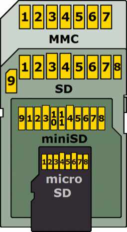

FatIFS
======

IFS library for Sming supporting FAT filesystems.

Notes
-----

Each :cpp:class:`FatIFS::FileSystem` object handles a single FAT partition.
Maintain mapping of partitions to logical drive letters so paths can be
modified accordingly.

For example, "/dir1/root.txt" will be passed to fatfs as "A:\dir1\root.txt".

SD Card connections
-------------------

   See https://en.wikipedia.org/wiki/SD_card

==========  =======  ============  ============  =====  ====  =======  ======================================
MMC pin     SD pin   miniSD pin    microSD pin   Name   I/O   Logic    Description
==========  =======  ============  ============  =====  ====  =======  ======================================
1           1        1             2             nCS    I     PP       SPI Card Select [CS] (Negative logic)
2           2        2             3             DI     I     PP       SPI Serial Data In [MOSI]
3           3        3                           VSS    S     S        Ground
4           4        4             4             VDD    S     S        Power
5           5        5             5             CLK    I     PP       SPI Serial Clock [SCLK]
6           6        6             6             VSS    S     S        Ground
7           7        7             7             DO     O     PP       SPI Serial Data Out [MISO]
-           8        8             8             NC     -     -        Unused (memory cards)
                                                 nIRQ   O     OD       Interrupt (SDIO cards) (negative logic)
-           9        9             1             NC                    Unused
-           -        10            -             NC                    Reserved
-           -        11            -             NC                    Reserved
==========  =======  ============  ============  =====  ====  =======  ======================================

Configuration options
---------------------

.. envvar:: ENABLE_EXFAT

   default: 0 (disabled)

   Set to 1 to enable support for EXFAT volumes.
   Required if enabling :envvar:`ENABLE_STORAGE_SIZE64` option.

Acknowledgements
----------------

- ChanN's fatfs library <http://elm-chan.org/fsw/ff/00index_e.html>`
- Linux Kernel <https://github.com/torvalds/linux/>
- Linux utilities https://github.com/util-linux/util-linux
- Linux FUSE exFAT filing system implementation https://github.com/relan/exfat
